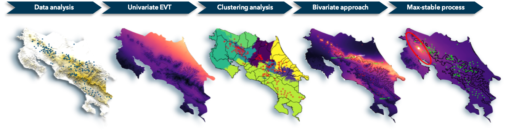

# A Study of Extreme Rainfall in Costa Rica with Multivariate Extreme Value Analysis

  

The study of extreme rainfall events through the construction of intensity-duration-frequency (IDF) curves is of great importance for water resource management and drainage basin systems design. This report focuses on creating IDF curves for extreme precipitation in Costa Rica, through the use of extreme value theory and deep learning. Bivariate and multivariate analyzes with non-stationary max-stable processes are used to quantify the joint probability of extreme rainfall at multiple sites, along with a regionalization approach based on hierarchical clustering to decompose the territory into regions with similar behaviours with respect to extreme events. This study highlights regions with strong seasonality and a clear demarcation between the Pacific and Caribbean coasts, especially for extreme precipitation events that extend over long periods. The use of machine learning tools allowed to model the local effects and the different weather systems present in Costa Rica.

This project is part of a thesis submitted in the fulfillment of the requirements for the Master Degree of Applied Mathematics at the École polytechnique fédérale de Lausanne. 

## Project structure

This repository contains the code to reproduce results from the report. All the results from this study can be found [here](results). The [code](code) folder is divided into several sections:
- the data preprocessing ([code](code/Chapter_1_Intro.R)).
- the exploratory analysis ([code](code/Chapter_2_Exploratory_Analysis.R)/[figures](results/Figures/chapter_2_exploratory_analysis)).
- the univariate analysis of extremes with generalized extreme value theory ([code](code/Chapter_3_Univariate_Analysis.R)/[figures](results/Figures/chapter_3_univariate_analysis)).
- the bivariate analysis with the Hüsler-Reiss model ([code](code/Chapter_4_Bivariate_Analysis.R)/[figures](results/Figures/chapter_4_bivariate_analysis)).
- the multivariate analysis with non-stationary max-stable processes ([code](code/Chapter_5_Multivariate_Analysis.R)/[figures](results/Figures/chapter_5_multivariate_analysis)).
- the clustering analysis based on the F-madogram ([code](code/Chapter_6_Clustering_Analysis.R)/[figures](results/Figures/chapter_6_clustering_analysis)).

## Shiny App

:construction: In construction... :construction:

## Credits

Antoine Bourret
